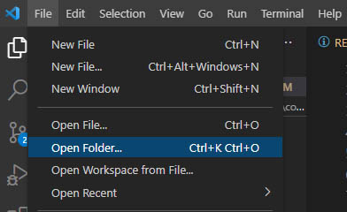
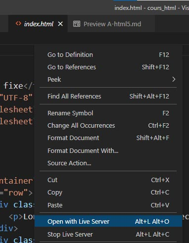

# 1. En préambule
Voir [Conseils et outils](https://github.com/seasgit/cours-html-css-21-22)  

# 2. Introduction à HTML
HTML est l'acronyme de `HyperText Markup Langage`.   
HTML est un langage de balisage dont le rôle est de structurer le contenu de pages web. 
La version avec laquelle nous travaillons est HTML5.  
On parle de __HTML5 sémantique__ car ses balises ont un rôle plus précis qu'avant dans la gestion du contenu d'un site web.

# 3. Structure d'un document HTML

## Visual Studio Code

Toujours faire `ouvrir un dossier` ou `nouveau dossier` afin d'avoir l'onglet gauche des dossiers et fichiers.  



Créer un Fichier avec un nom sans accent ni espace : __first-page.html__  
Une fois créé, le code ci-dessous peut être produit en tapant __!__ puis touche __tab__ ou __entrée__, selon l'IDE.
```html
<!DOCTYPE html>
<html lang="en">
    <head>
        <meta charset="UTF-8">
        <meta name="viewport" content="width=device-width, initial-scale=1.0">
        <meta http-equiv="X-UA-Compatible" content="ie=edge">
        <title>Document</title>
    </head>
    <body>
        <!-- contenu de la page -->
    </body>
</html>
```
## Dans `<head>`
La balise head ne s'affiche pas dans le document, elle contient tout ce dont à besoin la page pour s'afficher et fonctionner correctement.    _styles, scripts, polices de caractères, et autres metadonnées_. 
## Dans `<body>`
C'est là qu'on intègre le contenu de la page dans des balises qui représenteront le mieux chaque élément de la page.  
* Un titre de page : `<h1>Carnet de route</h1>`
* Un article de blog :  `<article> <!-- contenu --> </article>`  


# 4. Mise en pratique
La documentation proposée par Mozilla est exhausitive.   
On peut trouver des balises à partir d'un recherche par mots clé. On tape dans google _"html élément titre"_    

## Titres `<h1>-<h6> `
Documentation : [headings elements](https://developer.mozilla.org/fr/docs/Web/HTML/Element/Heading_Elements)  
Reproduire dans visual studio code, dans le body.
```html
    <body>
        <!-- contenu de page -->
    </body>
```
Puis `Faire un clic droit dans la page`  




## Paragraphes `<p>`
Documentation : [headings elements](https://developer.mozilla.org/fr/docs/Web/HTML/Element/p)
## Listes `<ul> ou <ol>`
Documentation : [Listes](https://developer.mozilla.org/fr/docs/Web/HTML/Element/ul)
## Images ``
Documentation : [Images](https://developer.mozilla.org/fr/docs/Web/HTML/Element/Img)
## Adressage relatif ou absolu
Les liens vers des fichiers externes peuvent être fait de 2 manières.  
### Adressage absolu
On donne l'url complète du document.  
    - Source d'une image :  
    ``
    - Lien vers Google :   
    `<a href="https://www.google.com" target="_blank">Page d'accueil Google</a>`    
### Adressage relatif 
On donne une adresse qui est relative à l'emplacement du fichier appelant au sein d'une architecture de dossiers d'un site web.
    - Ici une image placée dans le même que le document appelant :  
    ``     
    - Ici une image contenue dans un sous-dossier nommé _images_ :  
    ``  
    - Là une image contenue dans un dossier nommé _images_ en amont du fichier appelant :  
    ``  
## Lien hypertexte `<a>` 
documentation [Ancres](https://developer.mozilla.org/fr/docs/Web/HTML/Element/a)
### Lien externe
L'url peut être  : 
- absolue `<a href="https://example.com">Website</a>`
- relative. Le fichier requis doit être dans le dossier projet `<a href="./contact.html">contact</a>`


# 3. Introduction CSS
## Définition
CSS est l'acronyme de _Cascading Style Sheets_. 
Le terme _Cascade_ est en rapport avec des notions d'héritage et de surcharge de style. _(A voir en cours avec la pratique.)_  

Le langage CSS permet de mettre en page, d'aligner le contenu HTML. Il lui apporte aussi un style répondant à une identité visuelle recherchée.  
Le lien HTML/CSS est à l'intérieur des balises `<head></head>` d'un document HTML.
```html
<head>
    <meta charset="UTF-8">
    <title>Titre du site</title>
    <link rel="stylesheet" href="style1.css">
    <link rel="stylesheet" href="style2.css">
</head>
```
Un document html peut aussi contenir du style css de la manière suivante:
```html
<head>
    <meta charset="UTF-8">
    <title>Titre du site</title>
    <link rel="stylesheet" href="style1.css">
    <style>
        /* règles de style ici */
    </style>
</head>
``` 

## Règle de style
Si nous voulons donner un style à un titre par exemple, nous devons créer une règle css composée : 
* d'un sélecteur. Il fait le lien avec l'élément html
* d'une suite de propriétés placées entre __{ }__ et séparées chacune par un point virgule.
```css
h1{
    color: #FCC;
    font-weight:normal;
    letter-spacing :3px;
}
```
* Coder un texte de couleur verte de taille 40px avec une bordure, etc..."   


## L'inpecteur du navigateur
Il permet à l’intégrateur web de tester des balises html ou des règles css sans modifier sur le fichier source.   
Faites un clic droit sur la page et sélectionner. __Inspecteur__.


